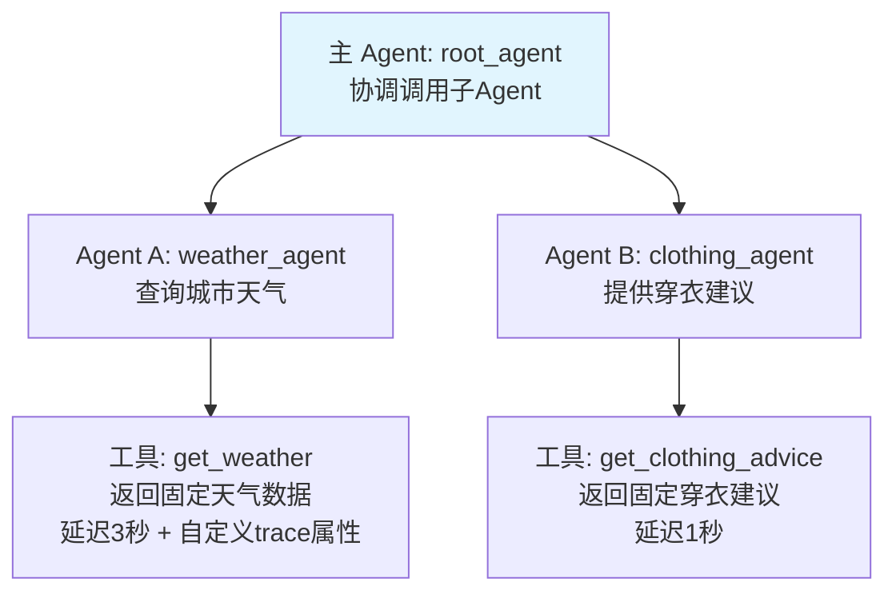
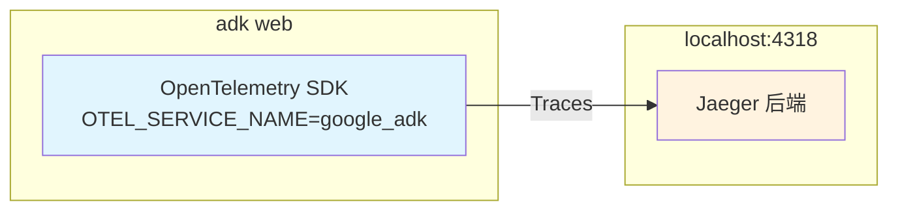

## 1. 何时需要可观测性

智能体交互变慢了，是调用工具还是查询知识库变慢了？工具调用了第三方的 API，估计是网络波动。哦不，知识库底层的 Milvus 没有做存算隔离，可能是这里的性能瓶颈？或者是系统缺少隔离，其他用户影响了当前用户？

当你开始考虑这个问题时，就说明系统缺少可观测的能力了。

得益于微服务架构的发展，智能体技术从构建之初，就可以基于成熟的可观测的能力。该能力，是解决智能体**从有用到可用**的关键点。

*注：除了 CodeAgent 以外，为何大部分的智能体都只是 demo 而没有用，就是另外一个话题了。*

从架构角度，需要提前考虑如何让智能体变得可用。无论系统设计的如何健壮，SRE 如何运维和弹性伸缩资源，系统长时间运行，总会出问题，而哪里会出问题则是不可预测的。

可观测性也是生产系统的基础：
1. 发现问题：比如观察到 调用逐渐变慢、返回错误 status 的次数 在逐渐增加  
2. 止损：发现是第三方工具调用变慢，则替换或者下掉工具  
3. 报告：是哪里出了问题，是否有连锁反应？通过指标，我们还观察到哪里也是隐患，只是本次没有暴露出来  
4. 改进：基于问题发生时的指标，比如 P99 延迟、错误率、业务逻辑指标等，避免只是追责而不知道如何优化  

上述效果也离不开传统的监控能力，或者我们通常说监控是从指标角度，而可观测则是换到了系统角度。

## 2. ADK 的可观测能力

ADK 原生支持接入多种可观测平台<sup>1</sup>，我用来验证的 agent 设计如下(实在不知道什么 agent 好用，只好总是用天气介绍😂)：



调用上述 agent 查看链路：


可以看到：
1. 一次 QA 的**完整流程**：例如从`root_agent` transfer 到`weather_agent`，以及调用 LLM(call_llm)、tool(execute_tool) 在哪个阶段发生  
2. **性能数据**：例如`generate_content`一共 5.59s，其中调用`get_weather`这个 tool 用了 2.5s.  
3. **链路对比**：例如两次调用 agent，有一次输出似乎没有使用本地工具，也可以对比正常、异常两次 traceID，使用 Compare 来对比链路的差异  

### 2.1. 可观测链路

因为只验证效果，所以采用 adk 直连 Jaeger 的方式

图片是 Jaeger 介绍的直连架构<sup>2</sup>：


Jaeger 上述组件在 V2 版本简化为了一个 bin，启动后我们的实际链路非常简洁：



集成可观测能力并不复杂，ADK 在内部已经实现了打点，我们要做的是在`adk web`前设置 OTLP 的环境变量，提供遥测数据发送的后端地址。

```bash
export OTEL_EXPORTER_OTLP_ENDPOINT='http://localhost:4318'
export OTEL_EXPORTER_OTLP_PROTOCOL='http/protobuf'
export OTEL_SERVICE_NAME='google_adk'
```

当然也可以自定义属性，例如：

```python
def get_weather(city: str) -> dict:
    """查询指定城市的天气"""
    # 模拟耗时：调用`get_weather`耗时 2.5 
    time.sleep(2.5)
    span = trace.get_current_span()
    span.set_attribute("custom_key", "current tool is get_weather")
    print(f"--- Tool: get_weather called for {city} ---")
    return {"city": city, "weather": "晴天", "temperature": "25°C"}
```


如果放到生产环境，可能还要考虑两点：
1. 不丢数据：Jaeger 提供了 Via Kafka<sup>2</sup>的方式
2. ADK 还提供了发送 log 的能力，如果不存在 log 端点会报错`Failed to export logs batch code: 404, reason: 404 page not found`，可能需要引入 OpenTeLemetry Collector 的中转组件。

测试代码放到了 github<sup>3</sup> 上

### 2.2. 如何做到的

1. 启动时：初始化各类 provider,例如`TracerProvider LoggerProvider MeterProvider`，读取环境变量并初始化对应的处理器(`maybe_set_otel_providers`)  
2. 调用时：例如 agent `run_async`调用的实现，会首先用`with tracer.start_as_current_span(...)`记录下来，即人工埋点   
如果是 adk web 的使用场景，也可以直接使用其 trace 能力

{:width="300"}

## 3. 参考资料

1. [ADK - Observability for agents](https://adk.dev/observability/)
2. [Jaeger - architecture](https://www.jaegertracing.io/docs/2.17/architecture/)
3. [Github - AI-Stems](https://github.com/izualzhy/AI-Systems/tree/main/google_adk/observability_agent)
