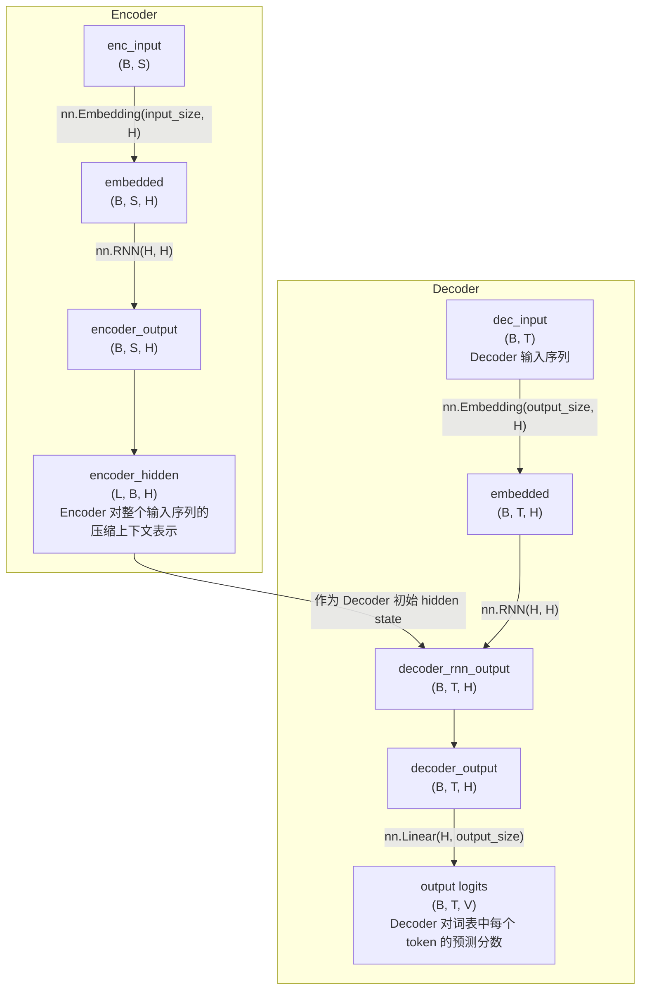
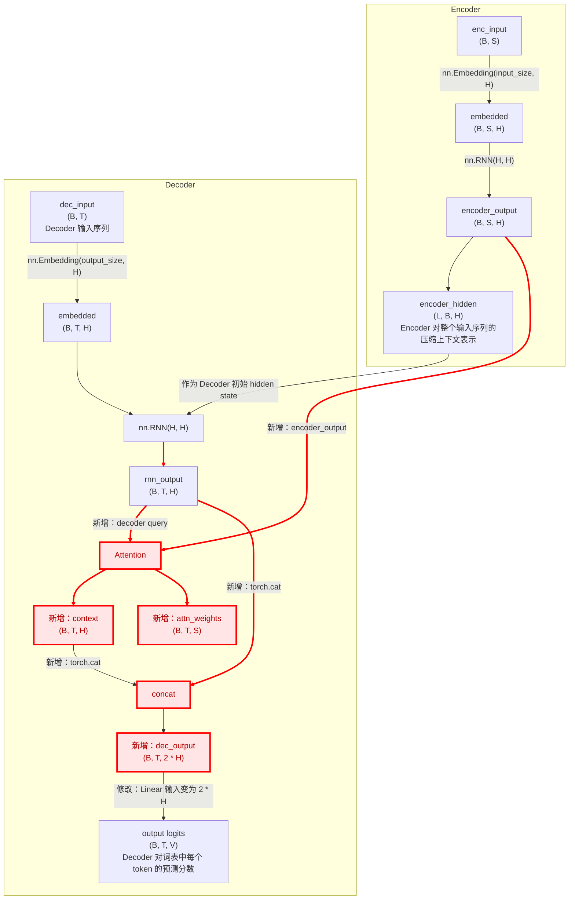

这篇笔记主要记录：

1. **Seq2Seq**: 机器翻译这类 序列到序列 的任务，需要先理解完整输入再生成输出, 而非 RNN 那样仅预测下一个 token.
2. **点积注意力**: 计算两个矩阵 X1 X2 的相似度，然后进一步计算 X1 融合了 X2 信息后的矩阵  
3. **带点积注意力的Seq2Seq**: 增加点积注意力，将编码器、解码器的隐藏状态联系起来，也就是能关注到输入序列中的重要部分，从而更好地捕捉上下文相关性

## 1. Seq2Seq

上一篇笔记讲到了 RNN, RNNLM 可以输入前面的词预测下一个词，例如 I love deep → learning ，即 sequence → next token 

机器翻译则是另外一个形式，要求输入:I love you 输出: 我爱你，即**一个输入序列 → 一个输出序列（sequence-to-sequence）**，因此后来发展出了 Encoder-Decoder（Seq2Seq）结构。

Seq2Seq 会先通过 Encoder 将输入序列编码为上下文表示（hidden state），再将其作为 Decoder 的初始 hidden state，逐步生成输出序列：

{:width="500"}

为了简化说明，编码器、解码器使用最基础的 nn.RNN 实现:  

```python
import torch.nn as nn # 导入 torch.nn 库
# 定义编码器类，继承自 nn.Module
class Encoder(nn.Module):
    def __init__(self, input_size, hidden_size):
        super(Encoder, self).__init__()       
        self.hidden_size = hidden_size # 设置隐藏层大小       
        self.embedding = nn.Embedding(input_size, hidden_size) # 创建词嵌入层       
        self.rnn = nn.RNN(hidden_size, hidden_size, batch_first=True) # 创建 RNN 层    
    def forward(self, inputs, hidden): # 前向传播函数
        embedded = self.embedding(inputs) # 将输入转换为嵌入向量       
        output, hidden = self.rnn(embedded, hidden) # 将嵌入向量输入 RNN 层并获取输出
        return output, hidden

# 定义解码器类，继承自 nn.Module
class Decoder(nn.Module):
    def __init__(self, hidden_size, output_size):
        super(Decoder, self).__init__()       
        self.hidden_size = hidden_size # 设置隐藏层大小       
        self.embedding = nn.Embedding(output_size, hidden_size) # 创建词嵌入层
        self.rnn = nn.RNN(hidden_size, hidden_size, batch_first=True)  # 创建 RNN 层       
        self.out = nn.Linear(hidden_size, output_size) # 创建线性输出层    
    def forward(self, inputs, hidden):  # 前向传播函数     
        embedded = self.embedding(inputs) # 将输入转换为嵌入向量       
        output, hidden = self.rnn(embedded, hidden) # 将嵌入向量输入 RNN 层并获取输出       
        output = self.out(output) # 使用线性层生成最终输出
        return output, hidden
n_hidden = 128 # 设置隐藏层数量
# 创建编码器和解码器
encoder = Encoder(voc_size_cn, n_hidden)
decoder = Decoder(n_hidden, voc_size_en)
print(' 编码器结构：', encoder)  # 打印编码器的结构
print(' 解码器结构：', decoder)  # 打印解码器的结构
```

定义 Seq2Seq 类，串联起来编码、解码过程：
```python
class Seq2Seq(nn.Module):
    def __init__(self, encoder, decoder):
        super(Seq2Seq, self).__init__()
        # 初始化编码器和解码器
        self.encoder = encoder
        self.decoder = decoder
    def forward(self, enc_input, hidden, dec_input):    # 定义前向传播函数
        # 使输入序列通过编码器并获取输出和隐藏状态
        encoder_output, encoder_hidden = self.encoder(enc_input, hidden)
        # 将编码器的隐藏状态传递给解码器作为初始隐藏状态
        decoder_hidden = encoder_hidden
        # 使解码器输入（目标序列）通过解码器并获取输出
        decoder_output, _ = self.decoder(dec_input, decoder_hidden)
        return decoder_output

# 创建 Seq2Seq 架构
model = Seq2Seq(encoder, decoder)
print('S2S 模型结构：', model)  # 打印模型的结构
```

定义训练过程，完成后的 model 即可以用来预测了：

```python
def train_seq2seq(model, criterion, optimizer, epochs):
    for epoch in range(epochs):
       encoder_input, decoder_input, target = make_data(sentences) # 训练数据的创建
       hidden = torch.zeros(1, encoder_input.size(0), n_hidden) # 初始化隐藏状态      
       optimizer.zero_grad()# 梯度清零        
       output = model(encoder_input, hidden, decoder_input) # 获取模型输出        
       loss = criterion(output.view(-1, voc_size_en), target.view(-1)) # 计算损失        
       if (epoch + 1) % 40 == 0: # 打印损失
          print(f"Epoch: {epoch + 1:04d} cost = {loss:.6f}")         
       loss.backward()# 反向传播        
       optimizer.step()# 更新参数

# 训练模型
epochs = 400 # 训练轮次
criterion = nn.CrossEntropyLoss() # 损失函数
optimizer = torch.optim.Adam(model.parameters(), lr=0.001) # 优化器
train_seq2seq(model, criterion, optimizer, epochs) # 调用函数训练模型
```

解释前面的代码：



说明：

| 名称 | 含义 |
|---|---|
| B: batch_size | 一次并行处理多少个样本（通常是一批句子） |
| S: seq_len | 每个序列包含多少个 token（同一个 batch 里，所有句子会被 padding 成相同长度） |
| T: target_seq_len | decoder 输入/输出序列长度（训练时=label长度，推理时=生成长度） |
| H: hidden_size | RNN hidden state 维度（本例中 embedding 维度与其相同） |
| V: vocab_size | 输出词汇表大小 |
| L: num_layers | RNN 堆叠层数 |

注：
1. 这个 Seq2Seq 结构简单，没有用到 encoder_output，后续注意力会用到。
2. 这里引入了 Teacher Forcing，之前看到的训练过程是 输入→模型→预测→对比真实值算
  loss。但在自回归模型中多了一步选择：各时间步的输入用预测值还是真实值？Teacher Forcing 即训练时使用真实 token 作为下一步输入。
3. 书里的代码用来简要说明模型，仅教学作用，比如输出序列长度受限于
  seq_len，若目标句子更长则会被截断。

## 2. 点积注意力

在干什么：  
- 输入：X1 X2
- 输出：X1 形状相同的矩阵，对 X1 的单个 token，融合了 X2 的每个 token 的向量，得到的结果。

我的理解就是**先计算 X1 X2 的相似度，然后进一步计算注意力(增加了softmax)，作为 X1 新的表示**。

首先**点积可以表示两个向量的相似程度**: t1 t2 形状均为 `(1, feature_dim)`, \\( \text{dot}(t_1, t_2) = t_1 \cdot t_2^T \\)，结果是一个 标量（scalar），

代码在原书里有，这里记录下我理解的形状变化过程:  

第 1 步： 初始时，x1.shape = (2, 3, 4) 、 x2.shape = (2, 5, 4)，即：x1: 3 个 token x2: 5 个 token , feature_dim=4   
第 2 步： \\( x_1 \cdot x_2^T = (\text{batch\_size}, \text{seq\_len}_1, \text{seq\_len}_2) \\), 其中 (b, i, j) 表示第 b 个样本中, x1 第 i 个元素与 x2 第 j 个元素的相似度

{:width="500"}

第 3 步： attn_weights.shape = (2, 3, 5), 矩阵表示 x1 x2 之间两两 token 的关注程度，其中一行表示 x1 的 1 个 token 对 x2 所有 token 的关注程度
例如：
```python
attn_weights =
[
  [
    [0.5, 0.2, 0.1, 0.1, 0.1],
    [0.1, 0.3, 0.4, 0.1, 0.1],
    [0.2, 0.2, 0.2, 0.2, 0.2]
  ],
  [
    [0.6, 0.1, 0.1, 0.1, 0.1],
    [0.2, 0.2, 0.3, 0.2, 0.1],
    [0.1, 0.1, 0.2, 0.3, 0.3]
  ]
]
```

x1 第 1 个 token 对 x2 的第 1 个 token权重 0.5，第2 个 token 权重，0.2，...，也就是最关注第 1 个

第 4 步： attn_weights @ x2: 即 \\( (\text{batch\_size}, \text{seq\_len}_1, \text{seq\_len}_2) \times (\text{batch\_size}, \text{seq\_len}_2, \text{feature\_dim}) = (\text{batch\_size}, \text{seq\_len}_1, \text{feature\_dim}) \\)

{:width="500"}

逻辑上理解这个过程：  
1. 基于每个 token 的向量表示，计算 x1 x2 之间两两每个 token 的相似度  
2. 对相似度矩阵每一行做 softmax， 得到 attention 权重， 表示： x1 的每个 token 应该关注 x2 各 token 的程度  
3. 使用 attention 权重 对 x2 的 token 向量加权求和， 得到新的上下文表示（context vector）  
4. 最终输出 shape： (batch_size, seq_len1, feature_dim) , 对应的是 x1 的每个 token “从 x2 中读取到的信息”  

从 点积注意力(Dot-Product Attention) 到 缩放点积注意力(Scaled Dot-Product Attention) ，变化主要是引入了**缩放因子**。

<div class="info" markdown="1">
1. 是什么：
缩放点积注意力在计算注意力权重之前，会将点积结果也就是原始权重除以一个缩放因子，得到缩放后的原始权重。
通常缩放因子取值=输入特征维度的平方根。

2. 为什么：使得 softmax 函数在一个较为平缓的区域内工作，从而减轻梯度消失问题。因此是在计算权重前引入这一步骤。
</div>

## 3. 带点积注意力的Seq2Seq

相比 1. Seq2Seq 的变化：
1. decoder 增加输入：encoder_output(encoder 各个时间步的 hidden state)
2. decoder RNN 层计算出 output 后，继续计算综合 encoder_output 的 attention contex 及 attention weight 
3. decoder 最终预测时，同时利用：

- Decoder 当前时刻状态（rnn_output）
- Encoder 提供的上下文信息（context）

因此相比原始 Seq2Seq，
Decoder 不再只能依赖单个 encoder_hidden，
而是**通过引入注意力，Seq2Seq 能够动态关注输入序列不同位置的信息(encoder_output)**。



其中红色部分是相比简化 Seq2Seq 增加的技术点。

**总结Attention 的核心思想是**：  
- 输入: X1 X2 矩阵，对于 X1 中的每个 token，根据它与 X2 各 token 的相似度，计算 attention 权重；再使用这些权重对 X2 做加权求和，得到新的上下文表示（context vector）。  
- 输出：shape 与 X1 相同的新矩阵，其中每个 token 的表示，已经融合了来自 X2 的相关信息。  

在 Seq2Seq Attention 中：  
- Decoder 输出（decoder hidden states）作为 Query  
- Encoder 输出（encoder outputs）作为 Key 和 Value  

因此：  
Decoder 在生成每个 token 时，可以动态关注 Encoder 不同位置的信息，而不再只依赖 Encoder 最后一个 hidden state。  
