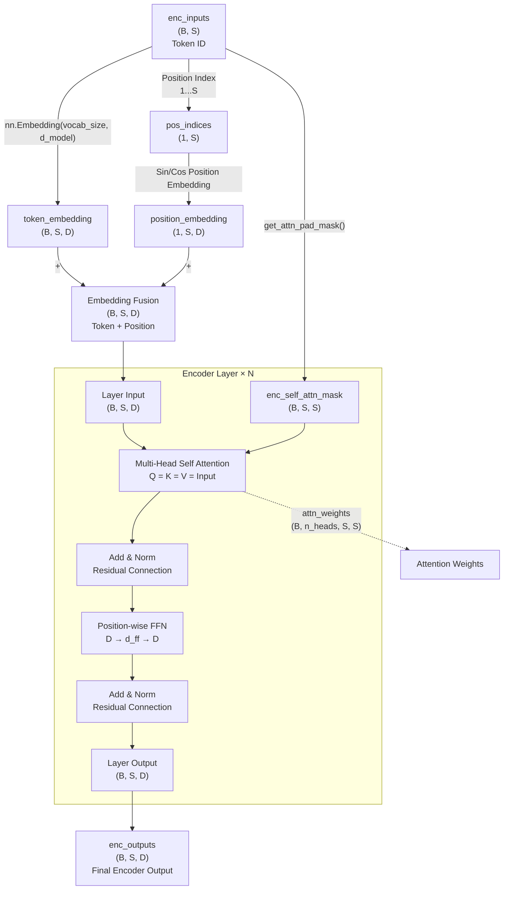
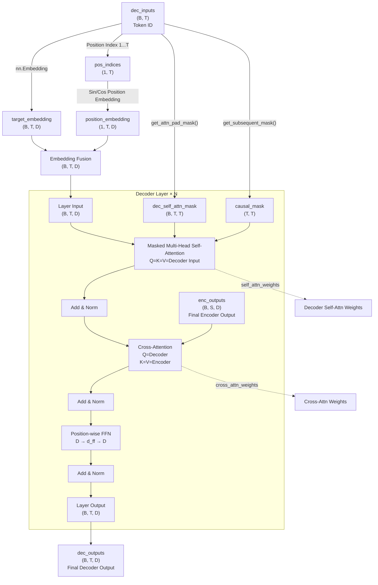
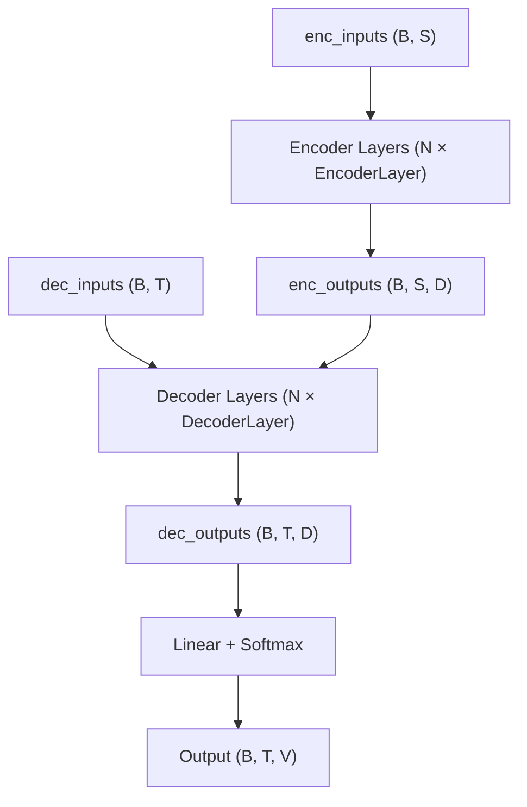

这篇笔记主要记录**Transformer**

我理解主要有几个变化：
1. 使用注意力机制代替 RNN 的递归状态传递（hidden state），从而摆脱时间步之间的串行依赖，实现并行计算。(Transformer 里完全不使用 RNN)
2. 引入位置编码，使模型能够感知 token 的位置信息；正弦位置编码还具有便于学习相对位置关系的性质  
3. 注意力包含了自注意力和 Cross-Attention（交叉注意力），两者都是多头注意力
4. 引入掩码机制，根据用途不同又分为填充掩码（Padding Mask）和因果掩码（Causal Mask）

## 1. Attention is All You Need

相比之前笔记[《GPT 图解》笔记：Seq2Seq及点积注意力](https://izualzhy.cn/llm-diagrammatize-seq2seq-attention)里的 Seq2Seq，Transformer 最大的变化就是不再需要任何循环神经网络结构，也就是代码里没有`self.rnn = nn.RNN`这一层了。

从功能角度，RNN 和 Attention 都是在解决**建模序列中的上下文依赖关系的问题**：如何让单个 token 不只知道自己，还知道上下文。

RNN 的思路是 把历史压缩进 hidden ，而 Attention 则是需要谁的信息, 就直接去读取谁。具体的：  
1. RNN 是通过隐藏状态的递归计算: The → animal → didn't → cross → ... → it ，对应: h1 → h2 → h3 → ... → ht ，即一步步把信息传递过来。  
2. Transformer 则通过注意力机制解决: \\( \text{softmax}\left(\frac{QK^T}{\sqrt{d_k}}\right)V \\)  

核心变化是：不再依赖 hidden state 逐步传递信息，而是利用 Attention 允许每个 token 根据需要动态聚合其它 token 的信息。从而更好地处理长距离依赖，并实现大规模**并行计算**。

## 2. Transformer 架构


接下来介绍下其中新出现的一些名词，然后解析该架构。

## 3. Transformer-位置编码

位置编码在编码器、解码器都存在，位于生成输入向量之后。位置向量与输入向量相加，生成新的表示向量。

RNN 和 Transformer 都有 Embedding 这一层： `embedding = nn.Embedding(vocab_size, hidden_size)`

流程上也都是： token id → Embedding → token vector

RNN 是顺序计算（h1 → h2 → ... → hn），因此计算过程天然包含顺序信息，不需要额外的位置编码。

Transformer 则做不到。

Self-Attention 可以建立 token 之间的两两关联关系（attention），但本身无法区分 token 的先后顺序。例如：
"I love you" 和 "you love I".

如果只看词向量集合，Self-Attention 本身并不知道谁在前谁在后。

Position Encoding 的作用是向模型显式提供位置信息，从而弥补 Self-Attention 本身**缺乏顺序感知能力的问题**。

具体的，位置编码本身并不会直接决定“谁关注谁”，它只是为每个 token 提供位置信息。真正的关注模式会在训练过程中由 Attention 的参数学习得到的。

例如，在大量语料中，模型可能经常看到类似 “The cat sat on the mat” 这样的结构。由于位置编码告诉模型 “cat” 和 “sat” 之间存在稳定的位置关系，而 Attention 又可以自由学习 token 之间的依赖，训练后模型往往会学到：在理解 “sat” 时，需要关注前面的主语 “cat”。

也就是说：位置编码提供“位置信息”，Attention + 参数学习决定“关注关系”。

那位置编码**是什么？**论文中采用的是正弦位置编码：
1. 偶数维：\\( PE(pos,2i)=\sin\left(\frac{pos}{10000^{2i/d_{model}}}\right) \\)
2. 奇数维：\\( PE(pos,2i+1)=\cos\left(\frac{pos}{10000^{2i/d_{model}}}\right) \\)

比如位置 100 的编码是：
```python
PE(100) = [
 sin(...),   # 第0维
 cos(...),   # 第1维

 sin(...),   # 第2维
 cos(...),   # 第3维

 sin(...),   # 第4维
 cos(...),   # 第5维
]
```

即每个位置都会同时拥有 sin 和 cos 两部分信息，放在 embedding 的不同维度里。 

**为什么**选择这个函数，我的理解是：   
Transformer 需要学习的是 Q、K、V 等参数矩阵。 这些参数不应该依赖于某个具体位置，否则模型只能处理训练时见过的位置。例如训练时见过 pos=1000，如果参数与绝对位置绑定，那么推理时遇到 pos=1001 就无法很好泛化。

因此可以推导出对**位置编码函数的要求：除了表示绝对位置外，还需要让模型容易学习“相对位置关系”**。

正弦位置编码恰好具有这样一个性质：对于每个频率对 (sin, cos)，PE(pos + k) 可以表示为 PE(pos) 的线性组合。

即存在一个仅依赖于 k 的变换矩阵，使得：
PE(pos + k) = W(k) · PE(pos)

其中 W(k) 只依赖于相对偏移量 k，而不依赖于具体位置 pos。

因此对于 Attention 来说，相同的相对偏移量总能对应到相同的变换模式。训练过程中，模型就更容易学习到：

- 距离当前 token 2 个位置的词比较重要
- 距离当前 token 10 个位置的词不太重要

等相对位置规律。

也正因为学习的是相对位置规律，而不是某个固定位置，所以模型能够泛化到训练时未出现过的序列长度。

可能更简洁的理解：正弦编码既能表示绝对位置，又能通过线性变换表达相对位置关系。  

## 4. Transformer-注意力

架构图中有两种注意力:

1. 多头自注意力
2. Cross-Attention（交叉注意力）

两种注意力最直接的区别：  
- Self-Attention：Q、K、V都来自同一个地方(编码器中则来自编码器输入、解码器中则来自解码器输入)  
- Cross-Attention：Q来自一个地方（解码器），K、V来自另一个地方（编码器）  

自注意力到多头注意力，主要是引入了多个子空间：

{:width="300"}
   
## 5. Transformer-Encoder

编码器由多个相同结构的层堆叠而成，每个层包含两个主要步骤：

1. （多头自注意力 → 残差连接 & 层归一化）
   - 掩码：使用 填充掩码（Padding Mask），忽略句子中的 [PAD] 占位符  
   - 输入：输入序列的词向量 + 位置编码的结合信息。

2. （前馈神经网络(FFN) → 残差连接 & 层归一化）
   - 作用：对自注意力层收集到的上下文信息进行非线性变换和特征提取，让模型学习更复杂的模式。
   - 输入：经过第一步处理后的特征向量（已融合全局信息）。
   - 输出：当前编码器层的最终表示，传递给下一编码器层。  

源码可以在作者的 github 找到，这里就不照抄了。梳理 Encoder 流程图及形状变化：



流程：  
1. `nn.Embedding` + 位置编码生成新的向量表示
2. 增加位置编码，遮挡 enc_inputs 中的 padding 位置  
3. 输入首先经过线性投影得到 Q、K、V，然后通过多头自注意力计算上下文表示(context)和注意力权重(weights)。  
4. FFN 迭代: \\( FFN(x) = W_2(ReLU(W_1x + b_1)) + b_2 \\)。注意这一层跟 Attention 层的区别，Attention 层主要更新：W_Q、W_K、W_V、W_O（输入到 Q/K/V 空间的投影矩阵），FFN 层主要更新：W1、W2（以及对应 bias）。Attention 负责决定看谁，FFN 负责决定看到之后如何加工这些信息

再深入到 Multi-Head Self Attention ，这里由两部分组成：`ScaledDotProductAttention MultiHeadAttention`

`ScaledDotProductAttention`实现缩放点积注意力 : 
- 输入: 
    - Q K V [batch_size, n_heads, len_q/k/v, dim_q=k/v] (为了实现点积，需约束 dim_q=dim_k) 
    - attn_mask [batch_size, n_heads, len_q, len_k]（跟 scores/weights 相同，用于忽略注意力分数）  attn_mask 
- 输出: 
    - 上下文向量(context): [batch_size, n_heads, len_q, dim_v]
    - 注意力分数(weights): [batch_size, n_heads, len_q, len_k]

`MultiHeadAttention`则定义了 QKV，同时实现了多个子空间调用`ScaledDotProductAttention`的效果。

每个子层都遵循：Sublayer(x) → 层归一化(x + Sublayer(x))

## 6. Transformer-Decoder

解码器也是由 N 个相同结构的层堆叠而成（原论文 N=6），每个层包含三个主要步骤：

1. （掩码多头自注意力 → 残差连接 & 层归一化）
- 掩码：同时使用填充掩码（Padding Mask）和因果掩码（Causal Mask）  
- 输入：解码器输入序列的词向量与位置编码的融合表示。
- 输出：融合历史上下文信息的隐藏表示。
2. （多头 Cross-Attention（交叉注意力） → 残差连接 & 层归一化）
- 原则：利用编码器输出的信息辅助当前 token 的生成。
- 掩码：仅使用编码器填充掩码（Encoder Padding Mask）  
- 输入：  
    - Query 来自步骤1的输出；
    - Key、Value 来自编码器最终输出。  
- 输出：融合源序列信息后的隐藏表示。
3. （前馈神经网络 FFN → 残差连接 & 层归一化）
- 作用：通 Encoder  
- 输入：经过交叉注意力后的隐藏表示  
- 输出：当前解码器层的最终表示，传递给下一解码器层  

在自注意里层，相比 Transformer-Encoder，这里多了 Causal Mask，主要是因为解码器采用自回归生成方式，每个位置只能看到当前位置及之前的位置，不能看到未来 token。

{:width="300"}

书里的图片比较复杂，我理解其实就是一个矩阵，比如原始 dec_inputs 大小是`(T)`，这里就是生成了一个`(T, T)`的矩阵(流程图里的`dec_self_attn_mask`)，对 dec_inputs 的第 i 个 token，按照矩阵第 i 行的数据遮挡，例如：

```
        K:
        <sos> I love you <eos>

Q <sos>  ✓    ×   ×   ×    ×
Q I      ✓    ✓   ×   ×    ×
Q love   ✓    ✓   ✓   ×    ×
Q you    ✓    ✓   ✓   ✓    ×
Q <eos>  ✓    ✓   ✓   ✓    ✓
```

梳理 Decoder 流程图及形状变化：



## 7. Transformer

Transformer 就是将 Encoder Decoder 结合起来：



Encoder Decoder 有很多相似之处，例如都是分层、都有掩码、注意力等，对比下区别：

| 对比维度 | **编码器** | **解码器** |
| :--- | :--- | :--- |
| **核心步骤** | 2步（自注意力 + FFN） | 3步（自注意力 + 交叉注意力 + FFN） |
| **掩码类型** | 仅填充掩码（Padding Mask） | 填充掩码 + 因果掩码（Causal Mask） |
| **交互对象** | 只和自身输入交互 | 自身输入 + 编码器输出（交叉注意力读编码器） |
| **核心目标** | 深度**理解**整个源序列 | **生成**目标序列，同时对齐源序列 |

注意编码器和解码器都有自注意力（Self-Attention），解码器额外包含交叉注意力（Cross-Attention）。这些注意力层通常都采用**多头注意力（Multi-Head Attention）**实现。

其中各个注意力层用到的掩码有：

1. 编码器-多头自注意力（Encoder Self-Attention）
    - Padding Mask: 用于遮挡编码器输入中的无意义 padding 位, 因为 Encoder 可以看到整个输入序列，所以不需要 Causal Mask。形状：`[B,S,S]`
2. 解码器-多头自注意力（Decoder Self-Attention）
    - Padding Mask: 用于遮挡解码器输入中的 padding 位。形状：`[B,T,T]`
    - Causal Mask: 用于遮挡当前位置之后的 token，防止解码器看到未来信息。形状：`[B,T,T]`
    - 实际参与计算的是两者合并后的 Mask：`M = M_padding | M_causal`
3. 解码器-编码器交叉注意力（Cross-Attention）
    - Encoder Padding Mask: Query(Q) 来自解码器，Key(K)、Value(V) 来自编码器输出。用于遮挡编码器侧的 padding 位。不涉及 Causal Mask，因为编码器序列是完整可见的。Mask 的作用，对于每个 Decoder Query，决定哪些 Encoder Key 可以被访问，所以形状：`[B,T,S]`（dim-2：T 表示 Decoder Query 数量, dim-3: S 表示 Encoder Key 数量，因此可以支持每个 Query，读取需要屏蔽哪些 Encoder Key）
 
因此粗略可以得出：Decoder = Encoder + Cross-Attention + Causal Mask  