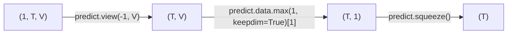
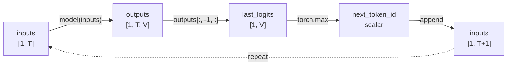

上一篇[《GPT 图解》笔记：Transformer](https://izualzhy.cn/llm-diagrammatize-transformer)最后一节提到了：
1. Encoder 能同时“看到”句子中所有位置的信息（左边和右边），适合理解句子。  
2. Decoder 每个位置只能“看到”它之前的位置（左边），未来的词被掩码遮住了，适合推理。  

在演进过程中，基于 Encoder 发展出来 BERT，基于 Decoder 发展出了 GPT.

这篇笔记主要记录**GPT**，主要有：

1. **贪婪解码到集束搜索**：贪心即选取局部最优解，集束则是在每一个保留多个高概率候选 token，实现累计最高概率  
2. **GPT 组件结构**：在 Decoder 基础上做了新增(softmax&linear)和删减(跟编码器的交叉注意力)  
3. **训练与推理过程中的自回归**：前者利用右移输入和 Causal Mask，在并行计算中模拟自回归约束；后者则是基于预测值继续预测    

## 1. 贪婪解码器

上一篇笔记是这么预测的：

```python
# 创建一个大小为 1 的批次，目标语言序列 dec_inputs 在测试阶段，仅包含句子开始符号 <sos>
enc_inputs, dec_inputs, target_batch = corpus.make_batch(batch_size=1,test_batch=True) 
print("编码器输入 :", enc_inputs) # 打印编码器输入
print("解码器输入 :", dec_inputs) # 打印解码器输入
print("目标数据 :", target_batch) # 打印目标数据
predict, enc_self_attns, dec_self_attns, dec_enc_attns = model(enc_inputs, dec_inputs) # 用模型进行翻译
predict = predict.view(-1, len(corpus.tgt_vocab)) # 将预测结果维度重塑
predict = predict.data.max(1, keepdim=True)[1] # 找到每个位置概率最大的词汇的索引
# 解码预测的输出，将所预测的目标句子中的索引转换为单词
translated_sentence = [corpus.tgt_idx2word[idx.item()] for idx in predict.squeeze()]
# 将输入的源语言句子中的索引转换为单词
input_sentence = ' '.join([corpus.src_idx2word[idx.item()] for idx in enc_inputs[0]])
print(input_sentence, '->', translated_sentence) # 打印原始句子和翻译后的句子
```

初始时，`dec_inputs = [<sos> <pad> <pad> <pad> <pad>]`。

调用 `model(enc_inputs, dec_inputs)`执行 1 次 forward 预测。forward 的内部流程：

```
Transformer.forward()
├── encoder(enc_inputs)                       1次
├── decoder(dec_inputs, enc_inputs, enc_outputs) 1次
└── projection(dec_outputs)                   1次
```

预测过程中形状变化：


因为提前构造了完整长度的 dec_inputs，这里一次得到所有位置的预测：token0 token1 token2 ... tokenT , 即每个位置最大概率的 token.

贪婪解码器则是一步步预测的，代码：  

```python
# 定义贪婪解码器函数
def greedy_decoder(model, enc_input, start_symbol):
    # 对输入数据进行编码，并获得编码器输出及自注意力权重
    enc_outputs, enc_self_attns = model.encoder(enc_input)    
    # 初始化解码器输入为全零张量，大小为 (1, 5)，数据类型与 enc_input 一致
    dec_input = torch.zeros(1, 5).type_as(enc_input.data)    
    # 设置下一个要解码的符号为开始符号
    next_symbol = start_symbol    
    # 循环5次，为解码器输入中的每一个位置填充一个符号
    for i in range(0, 5):
        # 将下一个符号放入解码器输入的当前位置
        dec_input[0][i] = next_symbol        
        # 运行解码器，获得解码器输出、解码器自注意力权重和编码器-解码器注意力权重
        dec_output, _, _ = model.decoder(dec_input, enc_input, enc_outputs)
        # 将解码器输出投影到目标词汇空间
        projected = model.projection(dec_output)        
        # 找到具有最高概率的下一个单词
        prob = projected.squeeze(0).max(dim=-1, keepdim=False)[1]
        next_word = prob.data[i]        
        # 将找到的下一个单词作为新的符号
        next_symbol = next_word.item()        
    # 返回解码器输入，它包含了生成的符号序列
    dec_outputs = dec_input
    return dec_outputs
```

预测过程中的内部流程:  
```
├── encoder(enc_input)      1次
└── for i in range(T):
        dec_input[0][i] = ...
        decoder(dec_input, enc_input, enc_outputs)  T次
        projection(dec_output)                      T次
```

Encoder 只计算一次，Decoder + Projection 重复计算 T 次。

每次循环，取第 i 个位置概率最大的 token，写回 dec_input[0][i]，更新该位置，然后基于新的预测继续预测。

这种基于当前时刻生成的 token，作为下一时刻的输入，继续参与后续 token 的预测的方式，就是典型的**自回归（Autoregressive）推理**。

注：自回归除了贪婪模式，还有其他例如集束搜索，文章末尾会提到。

这种“预测未来，再利用预测结果继续预测未来”的模式，让我想起之前看的一篇科幻小说 😁，主人公拥有一种能力，可以预测 5 分钟之后要发生的事情，突然有一天他意识到，基于这个能力，他可以预测 5 分钟后他会预测什么，那么他就可以预测 10 分钟后的事情了，以此类推，他就可以预测未来。

## 2. 搭建简化 GPT 模型

### 2.1. 组件

<figure>
  
  <figcaption class="img-source">图源：《GPT图解-大模型是怎样构建的》</figcaption>
</figure>

图里各组件的作用:   
<ol>
<li>多头自注意力：QKV 矩阵、记录 token 之间的关注信息</li>
<li>逐位置前馈网络：两个卷积层(标准似乎是两个 Linear)，总之就是两个矩阵</li>
<li>正弦位置编码：生成跟位置信息相关的向量</li>
<li value="45">填充掩码、后续掩码：通过预定义一个矩阵，避免关注到无用信息、未来信息</li>
<li value="67">将上述组件封装为一层的 DecoderLayer，大致流程：<code>Masked Self-Attention → Add&Norm → FFN → Add&Norm</code>，然后叠加多层封装为 Decoder</li>
<li value="8">投影层将 Decoder 输出的特征向量，转为具体的预测词</li>
</ol>

只有解码器，因此也就去掉了 Decoder 里的 编码器-解码器注意力 层。

书中这一节提到:

> GPT模型仅包含解码器部分，没有编码器部分。因此，它更适用于无条件文本生成任务，而不是类似机器翻译或问答等需要编码器-解码器结构的任务。

这是早期的观点，我们现在使用 ChatGPT 时，实际上也能翻译的。我理解是原始 Transformer 用 Encoder 理解源序列，再用 Decoder 生成目标序列；GPT 则把“源序列 + 任务指令 + 目标序列”统一看作一个长 Token 序列，通过 Decoder 的自回归生成完成翻译。

也就是后续的 GPT 不再区分翻译、问答、摘要等不同任务，而就看做 token 序列的条件生成问题。

有种一切皆 token 序列，一切皆生成的感觉。

### 2.2. 构造训练数据

我在很多时候不理解算法，都是卡在了没有理解最开始的数据结构和样例。书里使用了 WikiText2 来构建数据（目前源码在高版本 torchtext 已经跑不通了，可以使用 AI 修复下代码）。

相比之前的 demo，主要的区别有两个：  
1. 数据集不再是代码中手动定义的几条句子，而是通过 torchtext 下载 WikiText2 数据集  
2. 手动 `sentence.split(' ')` 改为使用 tokenizer 分词  

但是目的是相同的，vocab 含义相同，本质仍然是 token → id 的映射。

接下来具体说明下构造数据的代码流程(*注：代码参见原书*)。

首先，将每个句子转为 token id 序列：`tokens = [ vocab[<sos>], vocab(tokens).., vocab[<eos>] ]`。

然后，`__getitem__` 返回两个 Tensor：`source = tokens[:-1]`，`target = tokens[1:]`。即目标序列相对于输入**右移一位**，用于训练下一个 token 预测（右移的具体原因说明见2.3）。

由于一个 batch 中句子长度不一致，还需要两步补齐：
- `pad_sequence`：创建二维张量，第一维是句子个数，第二维是最大序列长度，用 `padding_value` 补齐
- `collate_fn`：计算 sources 和 targets 中最大长度，分别补齐，确保两者长度一致

这样大小整齐的数据，就可以用来训练了。

### 2.3. 训练过程中的自回归

训练中的自回归离不开**右移**操作。

假设有一个句子序列为`<sos> I love apple <eos>`      
- 输入序列 source: `<sos> I love apple`  
- 目标序列 target: `I love apple <eos>`  

source 是 Decoder 输入，target 是 Decoder 预测的目标值。

仍以`source = <sos> I love apple`为例，在 Decoder ，每个位置都会产生一个 Query：
```
Q0       Q1      Q2       Q3
 |        |       |        |
<sos>     I     love    apple
```

Causal Mask 作用在每个 Query 上，同时遮挡住了后续的 token，效果上即：

```
Q0: 只能看 <sos>
Q1: 只能看 <sos>, I
Q2: 只能看 <sos>, I, love
Q3: 只能看 <sos>, I, love, apple
```

这就是**训练过程中的自回归**

Decoder 在计算时，可以**并行计算**这个四个任务。输出：`outputs.shape = (B, T, V)`，例如这里就是`(1, 4, vocab_size)`

outputs 表示每个位置上的词的概率，例如:     
1. outputs[0,0,:] -> 预测 `I` 的概率分布
2. outputs[0,1,:] -> `love` 的
3. outputs[0,2,:] -> `apple` 的
4. outputs[0,3,:] -> `<eos>` 的

再跟`target = ['I', 'love', 'apple', '<eos>']`，逐位置计算`CrossEntropyLoss`

## 3. 预测

### 3.1. 贪婪解码

如果还是使用贪婪的方式，每次选取概率最大的 token，代码如下：

```python
# 测试文本生成
def generate_text(model, input_str, max_len=50):
    model.eval()  # 将模型设置为评估（测试）模式，关闭dropout和batch normalization等训练相关的层
    # 将输入字符串中的每个token 转换为其在词汇表中的索引
    input_tokens = [corpus.vocab[token] for token in input_str]
    # 创建一个新列表，将输入的tokens复制到输出tokens中，目前只有输入的词
    output_tokens = input_tokens.copy()
    with torch.no_grad():  # 禁用梯度计算，以节省内存并加速测试过程
        for _ in range(max_len):  # 生成最多max_len个tokens
            # 将输出的token转换为 PyTorch张量，并增加一个代表批次的维度[1, len(output_tokens)]
            inputs = torch.LongTensor(output_tokens).unsqueeze(0).to(device)
            outputs = model(inputs) #输出 logits形状为[1, len(output_tokens), vocab_size]
            # 在最后一个维度上获取logits中的最大值，并返回其索引（即下一个token）
             _, next_token = torch.max(outputs[:, -1, :], dim=-1)            
            next_token = next_token.item() # 将张量转换为Python整数            
            if next_token == corpus.vocab["<eos>"]:
                break # 如果生成的token是 EOS（结束符），则停止生成过程           
            output_tokens.append(next_token) # 将生成的tokens添加到output_tokens列表
    # 将输出tokens转换回文本字符串
    output_str = " ".join([corpus.idx2word[token] for token in output_tokens])
    return output_str
　
input_str = ["Python"] # 输入一个词：Python
generated_text = generate_text(model, input_str) # 模型根据这个词生成后续文本
print("生成的文本：", generated_text) # 打印预测文本
```

对应的逻辑图：



其中**repeat**即为自回归的过程。

### 3.2. 集束搜索

<figure>
  
  <figcaption class="img-source">图源：《GPT图解-大模型是怎样构建的》</figcaption>
</figure>

集束搜索是一种启发式搜索策略。

实际并不复杂，我理解贪心是贪心 1 步，集束就是贪心 N 步，保留多个高概率候选 token，然后取 N 步里最优的路径。

以书中代码为例：

```python
# 定义集束搜索的函数
def generate_text_beam_search(model, input_str, max_len=50, beam_width=5):
    model.eval()  # 将模型设置为评估模式，关闭dropout和batch normalization等与训练相关的层
    # 将输入字符串中的每个token 转换为其在词汇表中的索引
    input_tokens = [vocab[token] for token in input_str.split()]
    # 创建一个列表，用于存储候选序列
    candidates = [(input_tokens, 0.0)]
    with torch.no_grad():  # 禁用梯度计算，以节省内存并加速测试过程
        for _ in range(max_len):  # 生成最多max_len个token
            new_candidates = []
            for candidate, candidate_score in candidates:
                inputs = torch.LongTensor(candidate).unsqueeze(0).to(device)
                outputs = model(inputs) # 输出 logits形状为[1, len(output_tokens), vocab_size]
                logits = outputs[:, -1, :] # 只关心最后一个时间步（即最新生成的token）的logits
                # 找到具有最高分数的前beam_width个token
                scores, next_tokens = torch.topk(logits, beam_width, dim=-1)
                final_results = [] # 初始化输出序列
                for score, next_token in zip(scores.squeeze(), next_tokens.squeeze()):
                    new_candidate = candidate + [next_token.item()]
                    new_score = candidate_score - score.item()  # 使用负数，因为我们需要降序排列
                    if next_token.item() == vocab["<eos>"]:
                        # 如果生成的token是EOS（结束符），将其添加到最终结果中
                        final_results.append((new_candidate, new_score))
                    else:
                        # 将新生成的候选序列添加到新候选列表中
                        new_candidates.append((new_candidate, new_score))
            # 从新候选列表中选择得分最高的beam_width个序列
            candidates = sorted(new_candidates, key=lambda x: x[1])[:beam_width]
    # 选择得分最高的候选序列
    best_candidate, _ = sorted(candidates, key=lambda x: x[1])[0]
    # 将输出的 token 转换回文本字符串
    output_str = " ".join([vocab.get_itos()[token] for token in best_candidate if vocab.get_itos()[token] != "<pad>"])
    return output_str
　
model.load_state_dict(torch.load('best_model.pth')) # 加载模型
input_str = "my name"  # 输入几个词
generated_text = generate_text_beam_search(model, input_str)  # 模型根据这些词生成后续文本
print("生成的文本：", generated_text)  # 打印生成的文本
```

代码说明：  
1. 对当前的每个候选序列（candidates），计算下一个 token 的概率，取概率最高的 beam_width 个 token，分别追加到该候选序列后面，形成新的候选序列（候选数量最多扩展为 当前候选数 × beam_width）。  
2. 对所有新生成的候选序列，计算累计分数（通常是所有 token 的 log 概率之和），保留分数最高的 beam_width 个，作为下一轮的 candidates，继续生成。  

注意 2 实现跟图里的小差别，如果按照图里的方式，就是 beam_width^n 的候选数量变化。通过 2，确保了每一个位置预测后，总数量仍然是 beam_width.

整体来看，GPT 的核心思想并不复杂：保留 Transformer Decoder，通过 Causal Mask 实现训练阶段的并行自回归，再通过逐 token 生成完成推理。之前一直有个疑问：只有 Decoder 没有 Encoder，是怎么处理翻译、问答这些需要"理解输入"的任务？看到训练数据构造这一节才明白——GPT 把输入和输出拼成一个序列，"理解输入"本身就变成了预测下一个 token 的过程。一切皆生成。     

在书里这一章也算是终于 get 到了答案。  
