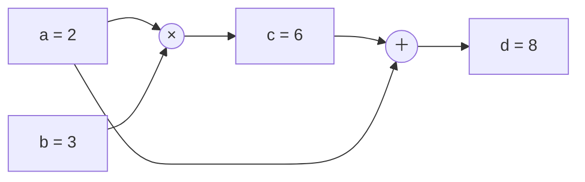
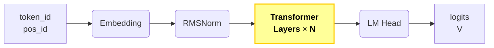
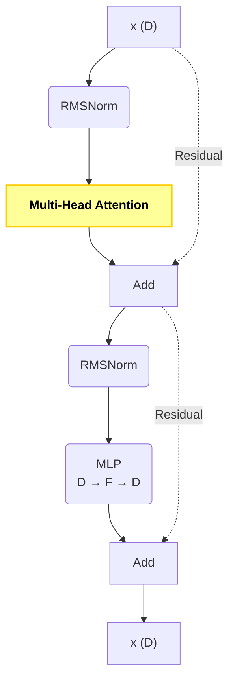
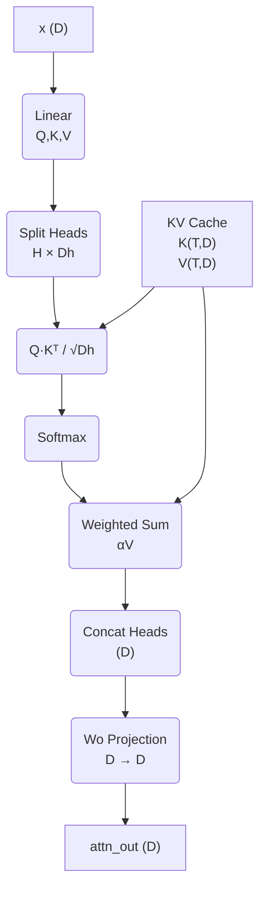
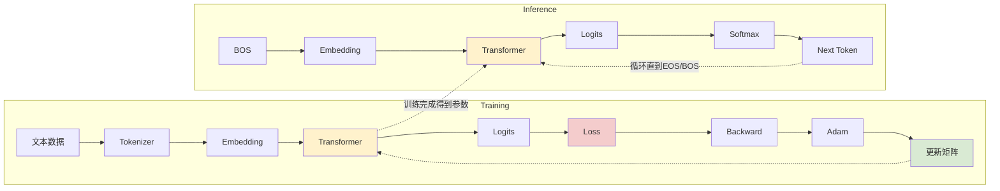

今年 2 月份 karpathy 发了一篇[极简版gpt](https://karpathy.github.io/2026/02/12/microgpt/)的文章，只有 200 行代码：

<script src="https://cdn.jsdelivr.net/npm/gist-embed@1.0.4/dist/gist-embed.min.js"></script>
<code 
    data-gist-id="8627fe009c40f57531cb18360106ce95" 
    data-gist-line="1-12"
    data-gist-hide-line-numbers="true"
    data-gist-file="microgpt.py"
    >
</code>

但是却完整模拟了 GPT 的训练（Training）和推理（Inference）流程，非常适合用来理解 GPT 的核心思想。

当时看完的感觉，就是能看懂每一行代码，但是关于**为什么**却完全不懂。最近看完[GPT图解-大模型是怎样构建的](http://izualzhy.cn/books.html#GPT图解-大模型是怎样构建的)，尝试解析下这 200 行代码。

gist 下面的讨论和 fork 很多，相信网上应该有很多的解析。这篇文章希望能从一个训推初学者的角度，提供一些见解。

## 1. Inference

推理的过程非常简单：从`BOS`开始预测下一个 token，直到`token_id == BOS`结束。  

```python
print("\n--- inference (new, hallucinated names) ---")
for sample_idx in range(20):
    keys, values = [[] for _ in range(n_layer)], [[] for _ in range(n_layer)]
    # 从 BOS 开始预测
    token_id = BOS
    sample = []
    for pos_id in range(block_size):
        # gpt 预测
        logits = gpt(token_id, pos_id, keys, values)
        probs = softmax([l / temperature for l in logits])
        token_id = random.choices(range(vocab_size), weights=[p.data for p in probs])[0]
        # 到 BOS 结束预测
        if token_id == BOS:
            break
        sample.append(uchars[token_id])
    print(f"sample {sample_idx+1:2d}: {''.join(sample)}")
```

`logits`是一个长度为`vocab_size`的数组(一维向量)，可以理解为模型对 vocab 里每个 token 的**打分**，分数越高，就是模型越倾向的 token.   
经过`softmax`处理后，`probs`形状不变，表示每个 vocab 出现的**概率**，形如：
```python
>>> [p.data for p in probs]
[0.02, 0.07, 0.032, 0.031, 0.058, 0.022, 0.029, 0.06, 0.023, 0.077, 0.02, 0.034, 0.008, 0.041, 0.074, 0.014, 0.015, 0.014, 0.061, 0.024, 0.043, 0.027, 0.012, 0.048, 0.069, 0.036, 0.038]
``` 
概率之和为 1.0，这也是`softmax`函数的特性。

`random.choices`则根据概率选出下一个`token_id`，直到遇到 BOS 结束。    

可以看出来决定预测结果的是`gpt`, `gpt`本质上是由 N 个矩阵组成的，矩阵的参数个数、值决定了预测的准确率。

训练的过程就是不断调整参数值的过程，那`gpt`都**包含哪些矩阵，每个矩阵的作用，参数值又是怎么更新的，为什么从 BOS 开始，又从 BOS 结束**，就是这篇文章尝试解释清楚的内容。

## 2. 基础知识

在介绍`gpt`前，需要先介绍几个基础知识，了解的话可以跳过或者直接看每一小节的结论。

### 2.1. Dataset & Tokenizer

代码里使用的 Dataset 是[names.txt](https://raw.githubusercontent.com/karpathy/makemore/refs/heads/master/names.txt)，形如：

```
emma
olivia
ava
isabella
sophia
charlotte
```

`gpt`的目标是要学习这些英文名字的规律，记录到矩阵里，然后预测名字。

神经网络无法直接处理字符串，只能处理数字，所以先通过 Tokenizer 将数据集里的字符串统一转换为数字。

创建一个简化的 Tokenizer:

```python
# Let there be a Tokenizer to translate strings to sequences of integers ("tokens") and back
uchars = sorted(set(''.join(docs))) # unique characters in the dataset become token ids 0..n-1
BOS = len(uchars) # token id for a special Beginning of Sequence (BOS) token
vocab_size = len(uchars) + 1 # total number of unique tokens, +1 is for BOS
print(f"vocab size: {vocab_size}")
```

names.txt 里都是大量的英文小写单词，所以`uchars`实际上是由 26 个小写英文字母组成：

```python
['a', 'b', 'c', 'd', 'e', 'f', 'g', 'h', 'i', 'j', 'k', 'l', 'm', 'n', 'o', 'p', 'q', 'r', 's', 't', 'u', 'v', 'w', 'x', 'y', 'z']
```

加上`BOS`(Beginning of Sequence), `vocab_size = 27`, 这样我们就可以用一组数字序列来表示数据集了。比如 emma → `[BOS, e, m, m, a, BOS]` → `[26, 4, 12, 12, 0, 26]`.

`BOS`的作用是作为分隔符。在训练过程中模型的参数可以总结数据的规律，例如会学习到这么一个规律：  

```
BOS → e
e → m
m → m
m → a
a → BOS
```

当然 GPT 实际学习的并不是这么一个条件概率(ref to[3.3. 多头自注意力](#33-多头自注意力))。

推理时，最开始输入 BOS，模型就会不断预测下一个 Token；当再次预测出 BOS 时，就认为整个名字已经生成完成。

注：
1. 这里的数据集只有约 32K 个名字，总共不到 20 万个字符。而现代大语言模型的训练数据通常达到 trillions of tokens，来源有网页、书籍、代码, etc.  
2. 严格来说，开始符（BOS）和结束符（EOS）通常是两个不同的特殊 Token。为了简化代码， microgpt 使用同一个 BOS 同时表示序列开始和结束。  
3. Tokenizer 实际可能是 BPE (Byte Pair Encoding) 等，一些高频词甚至会使用一个 token 表示，例如`the`、`ing`，这样序列长度更简短，效率更高、所需空间也更小。  

**经过这一步处理，GPT 看到的不再是 emma 这个名字，而是 `[26,4,12,12,0,26]` 这样的数字序列了。**  

### 2.2. 梯度

先复习下导数，假定 a 是常量，x 是变量，已知 $$ f = a * x $$ 。

那么 f 对 x 求导，表示为 $$ \frac{df}{dx} = a $$ 。

导数代表了 x 变化量对 f 变化量的影响程度，$$ Δf \approx a * Δx $$，比如 x 增加了 0.001，那么 f 就对应增加 $$ a * 0.001 $$.

反之，如果想要让 f 减少 0.001, 那么就可以让 x 减少 $$ 0.001/a $$

扩展到多元函数，就有了梯度的概念。假定 x、y 是变量，已知 $$ c = x * y $$，那么 $$ \frac{\partial c}{\partial x} = y $$，$$ \frac{\partial c}{\partial y} = x $$ ，即 $$ \nabla c = \left( \frac{\partial c}{\partial x}, \frac{\partial c}{\partial y} \right) = (y, x) $$

代表了 x y 变化时对 c 的影响程度，如果用 delta 表示： Δc = yΔx + xΔy

比如在 (2, 3) 位置，Δc = 3Δx + 2Δy，那么梯度就是 (3, 2)，沿着该方向增加 0.001，意味着在该方向 x y 的变化为：

$$
\hat{\mathbf{d}} = \frac{(3, 2)}{\sqrt{13}} = (0.83205, 0.55470)
$$

变化后位置: (2 + 0.832 * 0.001 = 2.000832, 3 + 0.555 * 0.001 = 3.000555)，对应 c 值为 6.003606

书里有梯度下降法的理论推导，我这里尝试用其他方向移动相同的 0.001 距离(为了公平比较不同方向，需要保证每次移动的距离相同，因此都先将方向向量归一化为单位向量)，计算 c 的新值来更直观的了解一下：

| 方向 | Δx | Δy | 变化后位置 | c 值 |
|:---|:---|:---|:---|:---|
| 梯度方向 (0.832, 0.555) | 0.832 × 0.001 | 0.555 × 0.001 | (2.000832, 3.000555) | **6.003606** |
| 只 x 方向 (1, 0) | 0.001 | 0 | (2.001, 3) | 6.003 |
| 只 y 方向 (0, 1) | 0 | 0.001 | (2, 3.001) | 6.003 |
| 方向 (0.6, 0.8) | 0.6 × 0.001 | 0.8 × 0.001 | (2.0006, 3.0008) | 6.0034 |
| 方向 (0.8, 0.6) | 0.8 × 0.001 | 0.6 × 0.001 | (2.0008, 3.0006) | 6.0036 |
| 方向 (-0.8, 0.6) | -0.8 × 0.001 | 0.6 × 0.001 | (1.9992, 3.0006) | 5.999 |   

理论上，相同单位距离，x y 轴按照梯度方向移动，会使 c 增加最多。反之，按照负梯度方向，则减少最多。

简言之，**如果想要让函数值最快减小，应该沿着负梯度方向修改参数**。
    
### 2.3. 梯度下降

从一维数据开始，假定我们有一组数据:

```python
x = [0, 1, 2, 3, 4, 5, 6, 7, 8, 9, 10]
y = [0.1, 1, 1.9, 3.1, 4, 4.9, 6.1, 7, 7.9, 9.1, 10]
```  

对应图中的散点，可以观察到都是在 $$ y \approx x $$ 蓝色虚线附近。

<figure>
  
</figure>

假定最简化的模型只有 1 个参数，预测公式为 $$ \hat y = a x $$ , 那么训练的目标，就是希望能够算出来 a = 1 ，这样就可以预测 x = 11 时 y 的值。 注意我们不能通过解析解或者肉眼观察来推出 a = 1，因为实际参数是在千亿甚至万亿级别，所以只能通过数值求解。  

现在需要想个办法，能够不断的迭代直到 \\( a \approx 1 \\)  

首先我们需要一个公式表示 预测值 比 真实值 差多少：

$$
L = \frac{1}{N} \sum_i (\hat{y}_i - y_i)^2
  = \frac{1}{N} \sum_i (ax_i - y_i)^2
$$

比如我们初时选择 a = 10 ，那么预测值就是：x=1 → 10, x=2 → 20, ..., x=10 → 100 , 即橙色虚线。两条线的差距很大，当 L 接近 0 时，预测就非常准确了。  

**那现在如何迭代 a，才能使得 L 变小？**答案自然就是上一节的梯度。  

计算 L 对 a 的梯度公式：

$$
\frac{\partial L}{\partial a} = \frac{2}{N} \sum_i (\hat{y}_i - y_i) x_i = \frac{2}{N} \sum_i (ax_i - y_i) x_i
$$

具体值套用到该公式：

$$
\frac{\partial L}{\partial a} = \frac{2}{11} * (0 + 9 + 362. + ... + 900) = \frac{2}{11} * 3464.7 = 629.94
$$

取单次移动的距离 η=0.01, 因为当前梯度为正，增大 a 会让 Loss 增大，因此沿着负梯度方向更新，即减去梯度：$$ a = a - η * 629.94 = 3.7005 $$，继续循环，a 会持续变小，直到 L 达到可以接受的误差值，此时 a 就已经非常接近于 1 了。

η 在神经网络里的学名叫做学习率。

这个例子中只有一个参数 a，因此梯度下降可以理解为在坐标轴上寻找 Loss 最小的那条曲线，曲线的斜率即为 a。而在真实 GPT 中，参数数量可能达到数百亿甚至上万亿个，参数空间已经无法可视化，但本质上仍然是在沿着 Loss 的负梯度方向不断调整参数，使 Loss 逐步减小。

也就是**换到高维(超多参数)，原理还是一样，即沿着各个参数的梯度方向迭代，每次减少一个学习率，不断循环，直到 Loss 小到符合预期。**  

### 2.4. 梯度实现

2.2 节讲了，如果 $$ c = x * y $$, 那么 $$ \nabla c = \left( \frac{\partial c}{\partial x}, \frac{\partial c}{\partial y} \right) = (y, x) $$ ；同时如果 $$ c = x + y $$，那么 $$ \frac{\partial c}{\partial x} = \frac{\partial c}{\partial y} = 1 $$

熟悉这两个公式，就可以看懂 microgpt 里`Value`的封装了:

```python
class Value:
    __slots__ = ('data', 'grad', '_children', '_local_grads')

    def __init__(self, data, children=(), local_grads=()):
        self.data = data                # scalar value of this node calculated during forward pass
        self.grad = 0                   # derivative of the loss w.r.t. this node, calculated in backward pass
        self._children = children       # children of this node in the computation graph
        self._local_grads = local_grads # local derivative of this node w.r.t. its children

    def __add__(self, other):
        other = other if isinstance(other, Value) else Value(other)
        return Value(self.data + other.data, (self, other), (1, 1))

    def __mul__(self, other):
        other = other if isinstance(other, Value) else Value(other)
        return Value(self.data * other.data, (self, other), (other.data, self.data))

    # ...

    def backward(self):
        topo = []
        visited = set()
        def build_topo(v):
            if v not in visited:
                visited.add(v)
                for child in v._children:
                    build_topo(child)
                topo.append(v)
        build_topo(self)
        self.grad = 1
        for v in reversed(topo):
            for child, local_grad in zip(v._children, v._local_grads):
                child.grad += local_grad * v.grad
```

`Value`用来表示一个计算过程中的节点，`data`表示节点值，`_children`表示来源的 Value 对象，`_local_grads`记录当前节点对各个来源节点（children）的局部导数，用于反向传播时应用链式法则, `grad`表示来自最终 Loss 的梯度。  

比如`x = Value(2) y = Value(3)`

1. `__mul__`实现了`c = x * y`，按照公式, c 值为 6，两个来源是 x y，对应梯度
$$ \frac{\partial c}{\partial x} = y $$, $$ \frac{\partial c}{\partial y} = x $$ , 所以定义为`Value(2 * 3, (x, y), (3, 2))`  
2. `__add__`实现了`c = x + y`，同样按照公式，c 值为 5，两个来源是 x y，梯度均为 1 , 所以定义为`Value(2 + 3, (x, y), (1, 1))`   

现在再一个计算过程理解下`backward`：  



那么怎么计算 a b c d 对最终结果 d 的梯度？

1. $$ \Delta d = \Delta d $$，因此 $$ \frac{\partial d}{\partial d} = 1 $$ 
2. $$ \frac{\partial d}{\partial c} = 1 $$，$$ \frac{\partial d}{\partial a} = 1 $$ , 此时 c a 梯度都是 1    
3. $$ \frac{\partial c}{\partial a} = b = 3 $$，$$ \frac{\partial c}{\partial b} = a = 2 $$，根据链式法则：$$ \frac{\partial d}{\partial a} += \frac{\partial c}{\partial a} \cdot \frac{\partial d}{\partial c} = 3x1 + 1 = 4 $$

也可以这么验证：$$ d = ab + a $$ ，所以：$$ \frac{\partial d}{\partial a} = b + 1 = 3 + 1 = 4 $$  ， $$ \frac{\partial d}{\partial b} = a = 2 $$

`backward`就是实现了上述计算过程。通过`backward`，按照链式法则，一次更新这条计算链路上所有 Value 的 grad .

$$
\underbrace{\frac{\partial L}{\partial \text{child}}}_{\text{child.grad}}
\;+=\;
\underbrace{\frac{\partial v}{\partial \text{child}}}_{\text{local\_grad}}
\times
\underbrace{\frac{\partial L}{\partial v}}_{\text{v.grad}}
$$

注意这里是 += 而不是 = , 因为一个节点可能通过多条路径影响最终 Loss，所以**梯度需要累加**。

在这个例子里，d 可以理解为最终的 Loss。调用 backward() 后，梯度会沿着计算图反向传播，按照链式法则自动计算所有节点对 Loss 的梯度。而所有节点的梯度，就决定了下一步优化的方向。

在真实 GPT 中，计算图会比这里复杂无数倍，但原理相同：**从 Loss 开始反向传播，最终得到每个参数的梯度，然后沿着负梯度方向更新参数**，真实 GPT 的计算图包含数十亿甚至万亿参数， 反向传播需要在所有参数上计算梯度， 因此训练成本极高。

### 2.5 矩阵

前面讲的 a 是一个参数，GPT 则是把大量参数组成矩阵: a → W. 梯度下降更新 a，也变成了更新矩阵 W 的每个元素。

例如：

$$
x = [1,2,3]
$$

经过矩阵：

$$
W =
\begin{bmatrix}
0.1 & 0.2 \\
0.3 & 0.4 \\
0.5 & 0.6
\end{bmatrix}
$$

映射后得到新的向量：

$$
y = xW
$$

计算 y 与 W 每个元素的梯度，就可以达到通过更新 W 来更新 y 的效果。
<figure>
  
  <figcaption class="img-source">图源：《深度学习入门：基于 Python 的理论与实现》</figcaption>
</figure>


因此训练过程就是更新矩阵，推理过程则是在使用矩阵。保存模型，存储的也还是这些矩阵。

到这里，基础概念已经介绍完成：

**1. Dataset: 训练的数据集**  
**2. Tokenizer：把文本变成数字；**  
**3. Gradient：告诉我们参数该往哪个方向调整；**  
**4. Backward：自动计算所有参数的梯度。**  

接下来终于可以开始介绍 GPT 本身了。

## 3. GPT

### 3.1. 整体架构

整体来看，GPT 架构如图：



token_id 是训练数据 tokenizer 后的结果; pos_id 是位置编码，在从 RNN 迁移到 Transformer 架构后，抛弃了 hidden state 带来并行能力，但也缺失了递归计算天然的顺序性。位置编码则提供了提供顺序感知能力，在[《GPT 图解》笔记里](https://izualzhy.cn/llm-diagrammatize-transformer#3-transformer-%E4%BD%8D%E7%BD%AE%E7%BC%96%E7%A0%81)专门介绍过。

两者对应的 Embedding 向量相加，得到最终输入表示 x，作为 Transformer 的输入。

`logits`即为 Transformer 预测的每个 token 的打分。

### 3.2. Transformer Layer

Transformer Layer 架构如图(注意因为是 GPT，所以只有解码器部分):



1. `RMSNorm`: 用于归一化  
2. `Multi-Head Attention`: 多头自注意力，由 Wq Wk Wv Wo 四个矩阵组成    
3. `Residual`: 残差连接，虚线不分，直接相加没有经过变换  
4. `MLP`: 用于预测的两层神经网络，由 mlp_fc1 mlp_fc2 两个矩阵组成, Attention 负责从上下文读取信息，MLP 则负责对当前 token 的表示进行非线性变换，相当于在每个位置上独立进行特征提取和组合。  

### 3.3. 多头自注意力

继续深入看 Multi-Head Attention 部分：



核心还是基于 Attention 公式：

$$
\text{Attention}(Q, K, V) = \text{softmax}\left(\frac{QK^T}{\sqrt{d_k}}\right) \cdot V
$$

关于 QKV 直观的解释：
1. Query: 找什么，作为搜索条件  
2. Key: token 用于被匹配的特征  
3. Value: 需要读取的信息，即内容  

比如对应句子： The animal didn’t cross the street because it was tired. 我们需要知道：it -> animal 而不是 street ，但是显然 Embedding 后：x_it x_animal x_street 只是普通向量，没有产生这个联系。

那就会希望 Q K V 能够学出来：

1. Q(it) ≈ [正在寻找“可指代对象”, 单数名词, 有生命]   
2. K(animal) ≈ [单数名词, 有生命, 可被代词指代]   
3. K(street) ≈ [地点, 无生命] 就可以满足：Q(it) · K(animal) >> Q(it) · K(street)   
4. 同时希望 V 能学到：V(animal) ≈ [动物语义, 生物属性, 主语信息, 上下文信息]    

Q K V 表达的含义不同，所以即使是相同来源，也要经过不同的变换，使得矩阵能够学到不同的特征，所以需要有 Wq Wk Wv 三个矩阵。   

注意：
1. Wq Wk Wv 是全部子空间的注意力矩阵，多头实现时按 head_dim 切片，每个 head 只看自己那一段。  
2. 真实训练过程中，Q/K/V 并不会显式学习上述标签，只是通过梯度下降在向量空间中自发形成了相似的结构。  

虽然只有几行矩阵乘法，但是我感觉 QKV 是最难理解的部分，可以参考之前的笔记：[《GPT 图解》笔记：QKV、多头注意力及掩码](https://izualzhy.cn/llm-diagrammatize-attention-qkv-multi-mask)  

## 4. GPT 代码

### 4.1. 参数

**模型参数是由多个矩阵组成。**

```python
n_embd = 16     # embedding dimension
n_head = 4      # number of attention heads
n_layer = 1     # number of layers
block_size = 16 # maximum sequence length
head_dim = n_embd // n_head # dimension of each head
matrix = lambda nout, nin, std=0.08: [[Value(random.gauss(0, std)) for _ in range(nin)] for _ in range(nout)]
state_dict = {'wte': matrix(vocab_size, n_embd), 'wpe': matrix(block_size, n_embd), 'lm_head': matrix(vocab_size, n_embd)}
for i in range(n_layer):
    state_dict[f'layer{i}.attn_wq'] = matrix(n_embd, n_embd)
    state_dict[f'layer{i}.attn_wk'] = matrix(n_embd, n_embd)
    state_dict[f'layer{i}.attn_wv'] = matrix(n_embd, n_embd)
    state_dict[f'layer{i}.attn_wo'] = matrix(n_embd, n_embd)
    state_dict[f'layer{i}.mlp_fc1'] = matrix(4 * n_embd, n_embd)
    state_dict[f'layer{i}.mlp_fc2'] = matrix(n_embd, 4 * n_embd)
params = [p for mat in state_dict.values() for row in mat for p in row]
print(f"num params: {len(params)}")
```

`matrix`: lambda 函数，创建一个 nout 行，nin 列的矩阵     

state_dict 保存所有矩阵：  

| 矩阵名 | shape | 作用 |
| :--- | :--- | :--- |
| wte | vocab_size × 16 | 将每个词ID映射为16维向量（Token Embedding） |
| wpe | 16 × 16 | 为每个位置（0~15）学习一个位置编码（Position Embedding） |
| layer0.attn_wq | 16 × 16 | 注意力机制的查询（Query）投影矩阵 |
| layer0.attn_wk | 16 × 16 | 注意力机制的键（Key）投影矩阵 |
| layer0.attn_wv | 16 × 16 | 注意力机制的值（Value）投影矩阵 |
| layer0.attn_wo | 16 × 16 | 注意力机制的输出（Output）投影矩阵，用于合并多头结果 |
| layer0.mlp_fc1 | 64 × 16 | MLP 的第一层全连接网络，将维度从16扩展至64（4倍扩展） |
| layer0.mlp_fc2 | 16 × 64 | MLP 的第二层全连接网络，将维度从64压缩回16 |
| lm_head | vocab_size × 16 | 将最后的16维表示映射回词表大小，用于预测下一个词 |

这是`gpt`训练、推理过程中使用的矩阵。  

总的参数量为`27*16*2 + 16*16*5 + 64*16*2`，共 4192 个参数。对比现在的大模型，很多都是千亿、万亿参数级别。

### 4.2. 三个常用函数：linear、softmax、rmsnorm

gpt 里用到的几个函数介绍

```python
def linear(x, w):
    return [sum(wi * xi for wi, xi in zip(wo, x)) for wo in w]

def softmax(logits):
    max_val = max(val.data for val in logits)
    exps = [(val - max_val).exp() for val in logits]
    total = sum(exps)
    return [e / total for e in exps]

def rmsnorm(x):
    ms = sum(xi * xi for xi in x) / len(x)
    scale = (ms + 1e-5) ** -0.5
    return [xi * scale for xi in x]
```

1. `linear`: 线性层矩阵乘法，$$ w \in \mathbb{R}^{n_{out} \times n_{in}},\ x \in \mathbb{R}^{n_{in}},\ w \cdot x \in \mathbb{R}^{n_{out}} $$  
2. `rmsnorm`: x 的归一化，输入输出 shape 不变。Root Mean Square Normalization, 每层都把向量的大小拉回"均方根≈1"的合理范围。  
3. `softmax`: 转概率，输入输出 shape 不变  

### 4.3. def gpt

经过前面的铺垫，这一节终于到了 gpt 代码部分，跟 [3.1.-整体架构](#31-整体架构) 一致。  

函数接收四个参数：
1. `token_id、pos_id`: 两者相加后作为 token 的 embedding, `rmsnorm`后作为 Transformer 的输入      
2. `keys、values`: names.txt 里一行，例如"emma"会作为一个 sentence/document, 其中每个 token 在处理后会追加到 kesy values   

```python
def gpt(token_id, pos_id, keys, values):
    tok_emb = state_dict['wte'][token_id] # token embedding
    pos_emb = state_dict['wpe'][pos_id] # position embedding
    x = [t + p for t, p in zip(tok_emb, pos_emb)] # joint token and position embedding
    x = rmsnorm(x)

    for li in range(n_layer):
        # 1) Multi-head attention block
        x_residual = x
        x = rmsnorm(x)
        q = linear(x, state_dict[f'layer{li}.attn_wq'])
        k = linear(x, state_dict[f'layer{li}.attn_wk'])
        v = linear(x, state_dict[f'layer{li}.attn_wv'])
        keys[li].append(k)
        values[li].append(v)
        x_attn = []
        for h in range(n_head):
            hs = h * head_dim
            q_h = q[hs:hs+head_dim]
            k_h = [ki[hs:hs+head_dim] for ki in keys[li]]
            v_h = [vi[hs:hs+head_dim] for vi in values[li]]
            attn_logits = [sum(q_h[j] * k_h[t][j] for j in range(head_dim)) / head_dim**0.5 for t in range(len(k_h))]
            attn_weights = softmax(attn_logits)
            head_out = [sum(attn_weights[t] * v_h[t][j] for t in range(len(v_h))) for j in range(head_dim)]
            x_attn.extend(head_out)
        x = linear(x_attn, state_dict[f'layer{li}.attn_wo'])
        x = [a + b for a, b in zip(x, x_residual)]
        # 2) MLP block
        x_residual = x
        x = rmsnorm(x)
        x = linear(x, state_dict[f'layer{li}.mlp_fc1'])
        x = [xi.relu() for xi in x]
        x = linear(x, state_dict[f'layer{li}.mlp_fc2'])
        x = [a + b for a, b in zip(x, x_residual)]

    logits = linear(x, state_dict['lm_head'])
    return logits
```

训练过程是多层的，每一层分两部分：Multi-head attention block → MLP block  

Wq Wk Wv 大小都是 16x16, 首先首先通过这三个不同矩阵，把同一个输入 x 投影成 q、k、v，大小都是(16,). 随后会被切分成 4 个 Attention Head，每个 Head 的 qkv_h 大小为 (4,)，然后独立计算`head_out`。

将 4 个 Head 的结果拼接：(4,) × 4 → x_attn=(16,)，再经过输出矩阵 attn_wo 映射回模型维度。

这里设计的`keys` `values`会追加当前处理的 token，而在外部又是在一个 document 内部逐个 token 调用`gpt`，因此处理前面 token 的时候，是看不到后面的 token 的，天然满足因果约束，标准 Decoder 则通过 Causal Mask 来实现。  

另外当推理第 5 个 token 时，由于第 1~4 个 token 的 K/V 已经计算完成，同时住家到了`keys` `values`，因此无需重复计算，直接缓存复用，即 KVCache.

这里`keys` `values`代码设计非常巧妙。

### 4.4. Training Loop

训练数据集的 docs 大约 32K 条，这里`steps=1000`，即只取前 1000 条数据用来模拟训练过程。当然这里只是演示，所以只使用了前 1000 条样本，并没有完整训练整个 names 数据集。
。真实训练通常会多轮遍历整个数据集（Epoch），并随机打乱顺序。

对于一条 doc ，多个 token 逐步放到`gpt`处理，注意这里的输入 token 是`tokens[pos_id]`，预期的输出 token 是`tokens[pos_id + 1]`，即该 doc 的下一个 token.

经过`gpt`处理后，选取预测为`target_id`的概率，计算`loss_t = -probs[target_id].log()`，该函数满足：当目标 token 概率接近 1 时 loss 接近 0，概率接近 0 时 loss 趋向无穷，这正好符合想要的惩罚效果。

然后经过`loss.backward()`反向传播，所有参与计算的矩阵里的元素，都计算出了当前训练样本上 loss 相关的梯度。

然后采用梯度下降法(Adam optimizer)，更新矩阵元素的值，循环往复，直到整个 loop 结束。

```python
# Let there be Adam, the blessed optimizer and its buffers
learning_rate, beta1, beta2, eps_adam = 0.01, 0.85, 0.99, 1e-8
m = [0.0] * len(params) # first moment buffer
v = [0.0] * len(params) # second moment buffer

# Repeat in sequence
num_steps = 1000 # number of training steps
for step in range(num_steps):

    # Take single document, tokenize it, surround it with BOS special token on both sides
    doc = docs[step % len(docs)]
    tokens = [BOS] + [uchars.index(ch) for ch in doc] + [BOS]
    n = min(block_size, len(tokens) - 1)

    # Forward the token sequence through the model, building up the computation graph all the way to the loss.
    keys, values = [[] for _ in range(n_layer)], [[] for _ in range(n_layer)]
    losses = []
    for pos_id in range(n):
        token_id, target_id = tokens[pos_id], tokens[pos_id + 1]
        logits = gpt(token_id, pos_id, keys, values)
        probs = softmax(logits)
        loss_t = -probs[target_id].log()
        losses.append(loss_t)
    loss = (1 / n) * sum(losses) # final average loss over the document sequence. May yours be low.

    # Backward the loss, calculating the gradients with respect to all model parameters.
    loss.backward()

    # Adam optimizer update: update the model parameters based on the corresponding gradients.
    lr_t = learning_rate * (1 - step / num_steps) # linear learning rate decay
    for i, p in enumerate(params):
        m[i] = beta1 * m[i] + (1 - beta1) * p.grad
        v[i] = beta2 * v[i] + (1 - beta2) * p.grad ** 2
        m_hat = m[i] / (1 - beta1 ** (step + 1))
        v_hat = v[i] / (1 - beta2 ** (step + 1))
        p.data -= lr_t * m_hat / (v_hat ** 0.5 + eps_adam)
        p.grad = 0

    print(f"step {step+1:4d} / {num_steps:4d} | loss {loss.data:.4f}")
```

当整个 loop 结束的时候，矩阵得到完全更新，loss 也降到很低。我们就可以用这些矩阵，来完成[Inference](#1-inference)里的预测了。

## 5. 总结

microgpt 代码不多，但是介绍了从数据 → 变成 Token → 经过矩阵计算 → 得到 Loss → Backward → 更新矩阵 → 最终能够生成文本 的整个流程：



回到最初的问题：包含哪些矩阵，每个矩阵的作用，参数值又是怎么更新的，为什么从 BOS 开始，又从 BOS 结束，我想在文章里都已经一一解答了。